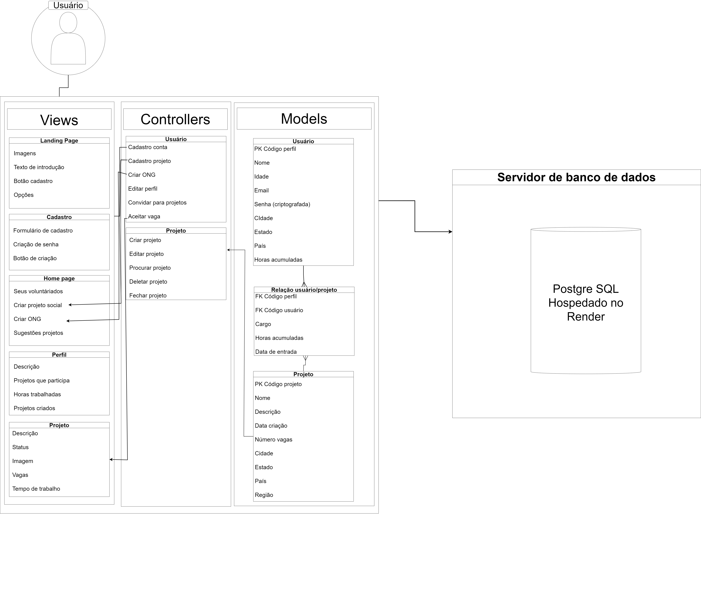

### Nome do Projeto: VTM
### Grupo: CSS
### Nome do Aluno: Bruno Crusinski
### Turma: 11

### MVC

### Descrição:
A proposta do grupo CSS para o VTM é uma aplicação em que voluntários e empresas possam criar perfis, mostrando seu portfólio de voluntário para o mundo. Simultaneamente ambos os tipos de perfil serão capazes de criar projetos sociais na plataforma, visando encontrar pessoas para auxiliar nele através de convites diretos para perfis e uma opção de selecionar vagas se disponíveis. Dessa forma, visamos unir a comunidade de voluntariado e ajudar nessa conexão entre voluntários, empresas e ações sociais.

### Arquitetura: MVC (Model-View-Controller)

### Ferramenta de Diagramação: draw.io

### Modelos (Models):

Os modelos se referem às tabelas do banco de dados da aplicação sendo esses três.
- Usuários: Guarda as informações individuais dos usuários
- Projetos: Guarda as informações referentes aos projetos em si.
- Relação usuário/projeto: Guarda as informações que se referem ao usuário e projeto ao mesmo tempo, encaixando essa modelagem dentro das Formas Normais e evitando problemas futuros

### Controladores (Controllers):
Nosso projeto apresenta dois controladores distintos, sendo um pro usuário e um do projeto, separando as ações que se aplicam a cada um destes.

- Usuário:
    - Cadastro conta: Permite que o usuário cadastre sua conta na plataforma
    - Cadastro projeto: PErmite o cadastro de um projeto em nome do usuário
    - Criar ONG: Permite o cadastro de uma ONG
    - Editar perfil: Mudança das informações do perfil
    - Convidar para projeto: Permite que ao navegar no perfil de outro usuário, é possível convidá-lo para um projeto de que se faz parte
    - Aceitar vaga: Permite aceitar uma vaga em um projeto, passando a constar no perfil do usuário

- Projeto
    - Criar projeto: Cria o perfil do projeto e o adiciona ao banco de dados
    - Editar projeto: Permite mudar as informações do projeto criado
    - Procurar projeto: Permite a pesquisa por projetos através de diversos tipos de filtros
    - Deletar projeto: Exclui o projeto do banco de dados do projeto
    - Fechar projeto: Permite que o usuário desative um projeto existente, que em vez de ser excluido só fica oculto para os demais (reversível através da edição)

Dessa forma, fomos capazes de mapear todas as possibilidades de ações dentro da plataforma, vindas do usuário e projeto de forma a interagir com os dados.

### Views (Views):
Parte visual do projeto que irá interagir com as ações disponíveis.

- Landing page: primeira página em que o usuário tem contato. Possui conteúdo promocional para engajamento e o botão para o cadastro
- Cadastro: Tela em que o usuário preencherá o formulário com seus dados pessoais e criará sua senha, sendo redirecionado para a home page
- Home page: Página principal em que serão exibidos os voluntariados da pessoa, sugestões de projetos para se engajar e as opções de cadastrar uma ONG ou projeto social
- Perfil: Página editável em que o usuário pode colocar suas informações para os demais usuários possam visualizar. Mostra também as horas de voluntariado e os dados a respeito de projetos com que se envolve.
- Projeto: Página dedicada ao projeto, contendo informações sobre o mesmo e o mecanismo de inscrições para vagas disponíveis.

### Infraestrutura:
O projeto consiste de um visual feito em HTML e CSS simples, um backend em JavaScript e um banco de dados Postgre SQL em um servidor da render, sem a pretensão de utilizar APIs externas ao menos que sejam fundamentais para demandas que surgirem durante o projeto.
Esses elementos representam as camadas do MVP, em que o usuário navega pelo View da plataforma (na prática o HTML e CSS), realiza ações no Comtroller que são feitas pelo JavaScript do backend e por fim interage com os Models modelados para o Postgre SQL no servidor da Render. A escolha de estruturar dessa forma foi a minimização de integrações desnecessárias de APIs que pudessem atrasar os prazos, simplificar ao máximo o número de ações ao não utilizar feeds ou recursos que demandam armazenamentos mais complexos e, por fim, evitar problemas com o banco de dados ao aplicar as formas normais desde cedo no projeto.

### Implicações da Arquitetura:
A arquitetura mais simples da solução permite uma fácil manutenção da estrutura, porém pode ser um empecilho para a escalabilidade. O plano básico do Render que utilizamos para essa versão não só tem prazo de uso curto, mas também tem limitações de tamanho do banco de dados e limites de escrita/leitura que impedem que o projeto escale indefinidamente sem que haja um esforço de adaptação e um aumento de investimento. Em termos de custo, o projeto é bastante sustentável no curto prazo, usufruindo de recursos gratuitos para a versão inicial que, como apresentado, prejudica a escalabilidade, contudo reduz o custo durante a fase inicial de testes e desenvolvimento.